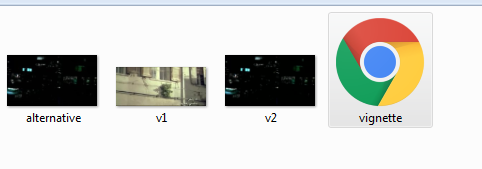
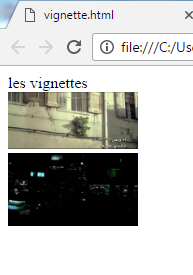
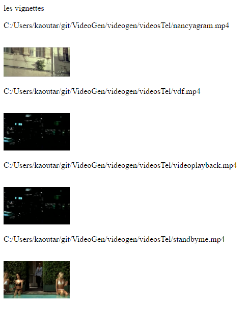
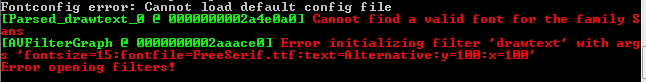
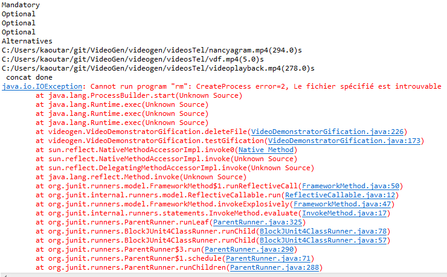

# VideoGen

A configurable generator of generator of video variants 

## Project structure

`org.xtext.example.videogenerator.*` are Xtext projects with the grammar and an extension to "tune" the IDE behavior (checking of unique IDs on the fly). 

`videogen` is a Java/Xtend project that uses the Xtext project and shows how to transform a VideoGen transformation. 

## Motivation

This project is here to randomly generate a new video with some samples videos. And we can add some options, like text on picture or gification. the objective is to create different output formats: ffmpeg or m3u.

The project use DSL, the model-to-text concept or model-to-model concept (transormation).

---------------------------------------------------

## Technology

- FFmpeg to transform videos by some scripts
- Xtext to create grammar, generate meta-model
- Xtend to use xtext grammar and models

---------------------------------------------------

M2 MIAGE students: Kaoutar Bennouna & Pierre-A. Totaro

##result 

Questions 1 to 13 OK with Junit test

Some examples:

## Project 1: Text inside Video

result inside JUnit:
---------------------------
Mandatory
debut
ffmpeg -i C:/Users/kaoutar/git/VideoGen/videogen/videosTel/nancyagram.mp4 -vf drawtext='fontsize=15:fontfile=FreeSerif.ttf:text=Mandatory:y=100:x=100' -codec:a copy C:/Users/kaoutar/git/VideoGen/videogen/videosTel/nancyagram-2.mp4

C:/Users/kaoutar/git/VideoGen/videogen/videosTel/nancyagram-2.mp4
Optional
debut
ffmpeg -i C:/Users/kaoutar/git/VideoGen/videogen/videosTel/vdf.mp4 -vf drawtext='fontsize=15:fontfile=FreeSerif.ttf:text=Optional:y=100:x=100' -codec:a copy C:/Users/kaoutar/git/VideoGen/videogen/videosTel/vdf-2.mp4

Optional
Optional
debut
ffmpeg -i C:/Users/kaoutar/git/VideoGen/videogen/videosTel/videoplayback.mp4 -vf drawtext='fontsize=15:fontfile=FreeSerif.ttf:text=Optional:y=100:x=100' -codec:a copy C:/Users/kaoutar/git/VideoGen/videogen/videosTel/videoplayback-2.mp4

Alternatives
debut
ffmpeg -i C:/Users/kaoutar/git/VideoGen/videogen/videosTel/standbyme.mp4 -vf drawtext='fontsize=15:fontfile=FreeSerif.ttf:text=Alternative:y=100:x=100' -codec:a copy C:/Users/kaoutar/git/VideoGen/videogen/videosTel/standbyme-2.mp4

-------------------------------------------------------------------
New files are created without any content (size=0 ko)

In Cmd console:

So, UNRESOLVED BUG about bad path or unknown fonts

----------------------------------

## 2: Gification

Result in JUnit console:

So, UNRESOLVED BUG

